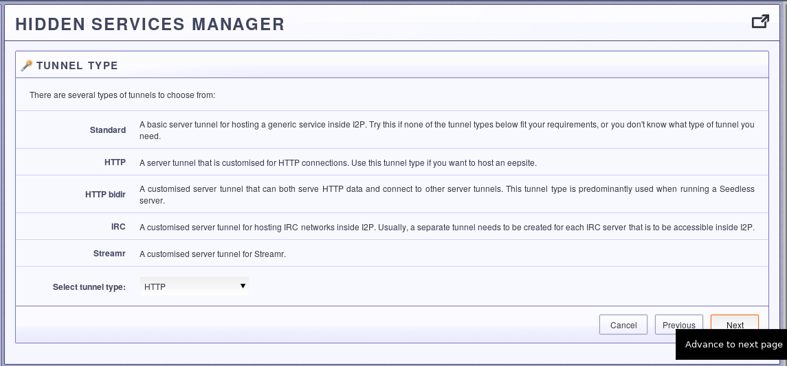
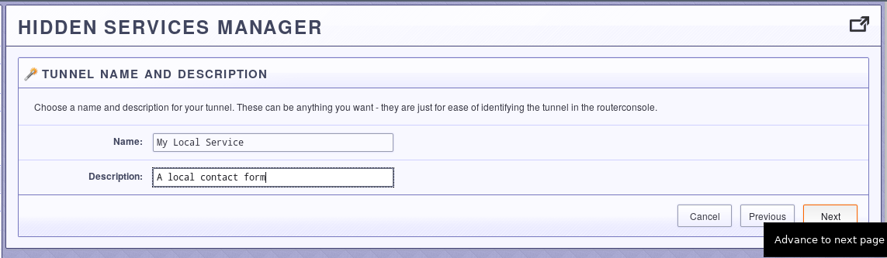
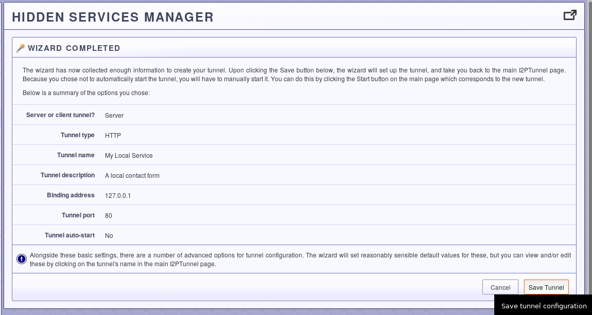
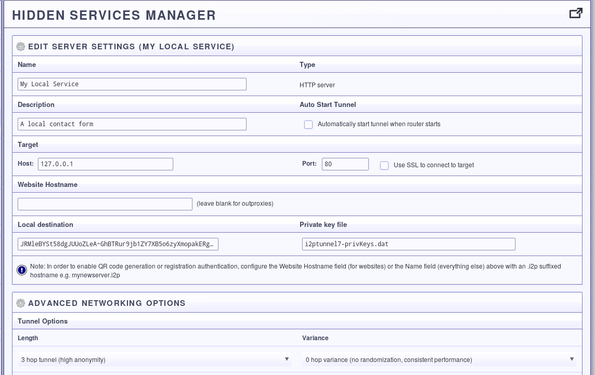
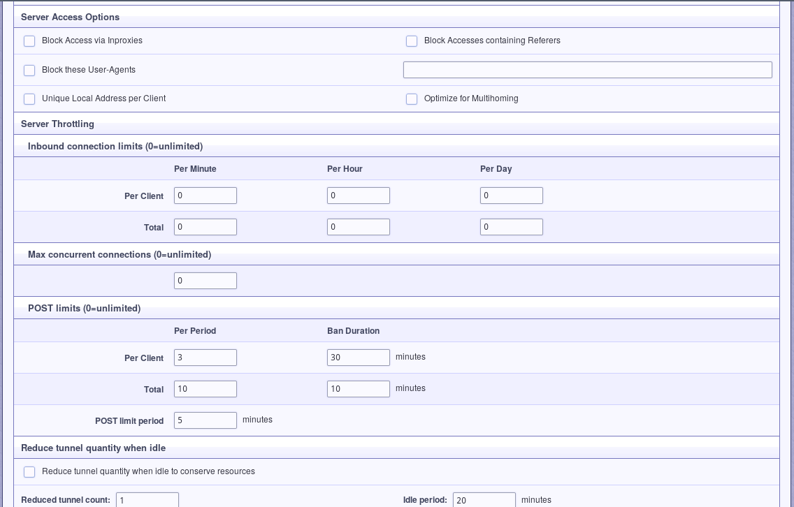

Basic i2p Tunnels Tutorial with Pictures
========================================

Although the Java i2p router comes pre-configured with a static web server,
jetty, to provide the user's first eepSite, many require more sophisticated
functionality from their web server and would rather create an eepSite with a
different server. This is of course possible, and actually is really easy once
you've done it one time.

Although it is easy to do, there are a few things you should consider before
doing it. You will want to remove identifying characteristics from your web
server, like potentially identifying headers and default error pages that
report the server/distro type. More information about threats to anonymity
posed by improperly configured applications see:
[Riseup here:](https://riseup.net/en/security/network-security/tor/onionservices-best-practices),
[Whonix Here:](https://www.whonix.org/wiki/Onion_Services),
[This blog article for some opsec fails:](https://blog.0day.rocks/securing-a-web-hidden-service-89d935ba1c1d),
[and the i2p applications page here](https://geti2p.net/en/docs/applications/supported).
Although much of this information is expressed for Tor Onion Services, the same
procedures and principles apply to hosting applications over i2p.

Step One: Open the Tunnel Wizard
--------------------------------

Go to the i2p web interface at 127.0.0.1:7657 and open the
[Hidden Services Manager](http://127.0.0.1:7657/i2ptunnelmgr)(links to
localhost). Click the button that says "Tunnel Wizard" to begin.

Step Two: Select a Server Tunnel
--------------------------------

The tunnel wizard is very simple. Since we're setting up an http *server*, all
we need to do is select a *server* tunnel.

Step Three: Select an HTTP Tunnel
---------------------------------

Now I may be wrong, but I'm pretty sure that the only difference between http
server tunnels and regular server tunnels is that http server tunnels add in
the X-I2P-DEST* header's using the repliable address of the client visiting the
site. If you don't make use of X-I2P-DEST, you could just use a server tunnel.
Nonetheless, select the HTTP tunnel for now.

Step Four: Give it a name and a description
-------------------------------------------

For your own benefit and ability to remeber and distinguish the what you are
using the tunnel for, give it a good nickname and description. If you need to
come back and do more management later, then this is how you will identify the
tunnel in the hidden services manager.

Step Five: Configure the Host and Port
--------------------------------------

In this step, you point the web server at the TCP port where your web server is
listening. Since most web servers listen on port 80 or port 8080, the example
shows that. If you use alternate ports or virtual machines or containers to
isolate your web services, you may need to adjust the host, port, or both.

Step Six: Decide whether to start it automatically
---------------------------------------------------

I cannot think of a way to elaborate on this step.

Step Seven: Review your settings
------------------------------

Finally, take a look at the settings you have selected. If you approve, save
them. If you did not choose to start the tunnel automatically, go to the hidden
services manager and start it manually when you wish to make your service
available.

Appendix: HTTP Server Customization Options
-------------------------------------------

i2p provides a detailed panel for configuring the http server tunnel in custom
ways. I'll finish this tutorial by walking through all of them. Eventually.

